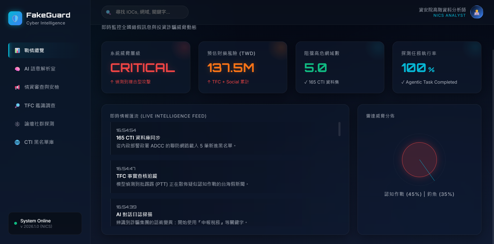
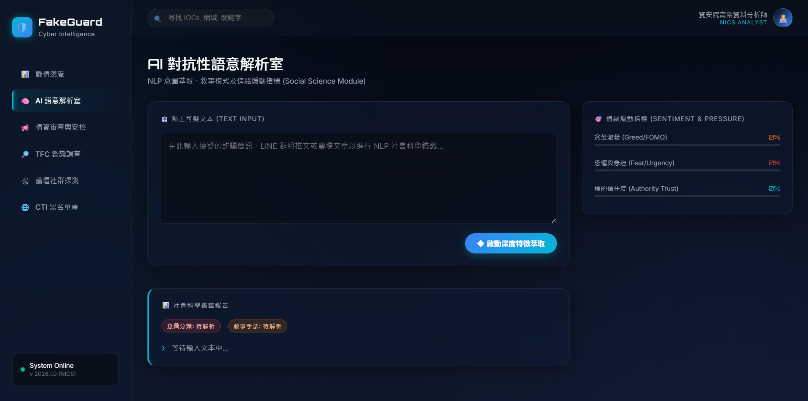
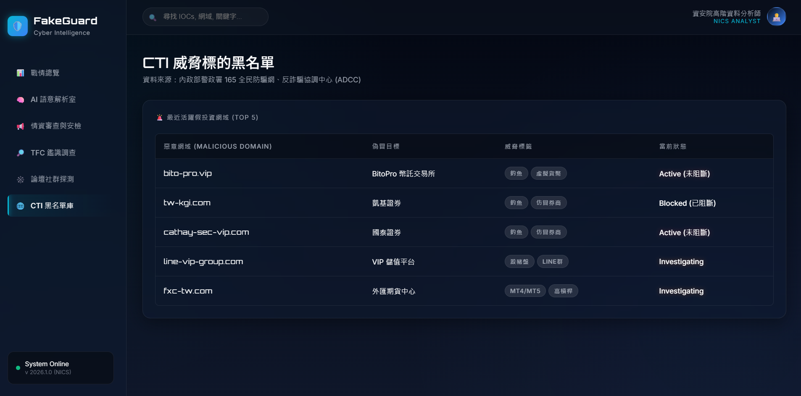

<div align="center">
  

  <h1>🛡️ FakeGuard Cyber Intelligence (NICS)</h1>
  <p><strong>國家資通安全研究院 (NICS) - 概念驗證鑑識儀表板</strong></p>
  <p>從結構化威脅情資 (CTI) 到 AI 社會科學語意解析，打造全域聯防的戰略指揮中心。</p>

  <p>
    
    
    
    
    
  </p>
</div>

<br>

<div align="center">
  <!-- 建議在此處放上一張滿版的儀表板主畫面截圖 -->
  
  <p><i>💡 戰情總覽全區視角 (Overview Dashboard)</i></p>
</div>

## 📑 專案背景 (Background)

本專案旨在模擬並實作 **國家資通安全研究院 (NICS) 高階資料分析師** 的核心業務系統。針對日益猖獗的「認知作戰」、「假投資群組」與「釣魚網站」，傳統的人工通報與 165 黑名單建檔流程已無法應付秒級變異的網路威脅。

因此，**FakeGuard CTI 儀表板** 融合了「自動化情報爬蟲」、「啟發式 NLP 特徵萃取」與「165 情資審查審核機制」，實現了**主動威脅獵捕 (Proactive Threat Hunting)** 的概念驗證 (PoC)。

---

## 🚀 核心四大模組 (Core Modules)

### 1. 📊 戰略指揮總覽 (Command Center)
- **Live Intelligence Feed**: 動態接收來自各節點（如 Dcard 探測器、165 LINE機器人）的零時差 (Zero-day) 威脅情資。
- **Threat Radar**: 把複合型攻擊（認知作戰 + 投資詐欺）量化為具體的財務風險（ROI Impact），供決策層調度跨部會資源。

<div align="center">
  
  <p><i>💡 AI 語意解析室：具象化社會科學分析過程</i></p>
</div>

### 2. 🧠 AI 社會科學語意解析室 (Social Science NLP)
打破常規的關鍵字比對，此模組運用**犯罪心理學**與**社會工程學**角度解析文本。
- **Greed & FOMO (貪婪與錯失恐懼)**：衡量文本對受害者施加的金錢誘惑。
- **Fear & Urgency (恐懼與時間壓力)**：衡量文本是否企圖癱瘓受害者理性。
- **Authority Trust (訴諸權威)**：辨識偽冒官方機構（如國安基金、內政部）的詐騙釣魚特徵。

### 3. 🔍 165 情資審查與安檢 (Triage & Takedown)
- 模擬 ADCC (反詐騙協調中心) 的每日防線。
- 分析師可抓取民眾通報動態牆上的可疑網域，送入檢測引擎進行「自動化威脅鑑識 (Deep Scan)」。
- 具備**一鍵發送 ISP 阻擋指令**的決策 UI，縮短行政流程。

<div align="center">
  
  <p><i>💡 CTI 威脅黑名單庫：大型資料檢索體驗</i></p>
</div>

### 4. 🌐 CTI 威脅標的黑名單 (Threat Indicator DB)
- 展示百萬級資料庫的縮影設計。
- 整合 GeoIP 主機位置、首次偵測時間 (First Seen) 與動態威脅標籤。
- 提供實體黑名單搜尋與統計（如最常被偽造的金融品牌）。

---

## 🛠️ 技術堆疊 (Tech Stack)

* **Backend API**: `Python 3.11`, `Flask`, `Flask-CORS`
* **Database**: `SQLite3` (輕量化本地封裝，易於 Demo)
* **Intelligence Processing**: Custom Heuristic Algorithm (Python/JS) 
* **Frontend Dashboard**: `HTML5`, `Vanilla CSS` (Glassmorphism + Dark UI), `Vanilla JS` (ES6 Fetches)

---

## ⚡ 快速啟動 (Quick Start)

只要兩步，即可在本地運行全套資安火力指揮所：

1. **啟動 API 與資料庫伺服器 (Port 5000)**
   ```bash
   python app.py
   ```
   *(系統啟動時若偵測無 `fakeguard.db`，將自動生成初始 NICS 情報種子)*

2. **開啟戰情儀表板**
   - 直接用瀏覽器開啟資料夾內之 `FakeGuard_Dashboard/index.html`。
   - 或使用 VSCode 的 `Live Server` 套件開啟以獲得最佳體驗。

---

## 👨‍💻 開發者 (Developer)

**NICS Senior Analyst Candidate**
<br>
*本專案為國家資通安全研究院 (NICS) 甄選之火力展示作品 (PoC)，所有情資與數據均為開源改寫或合規模擬，不涉及國家機密資料。*
